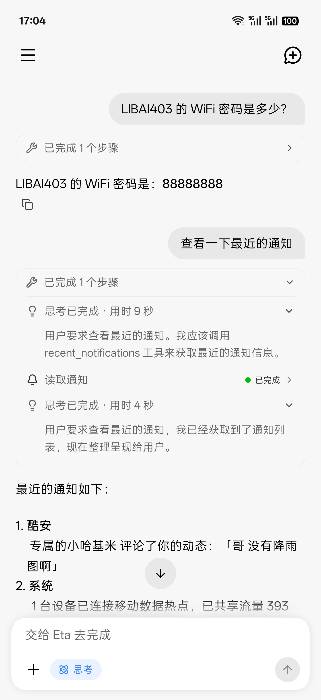
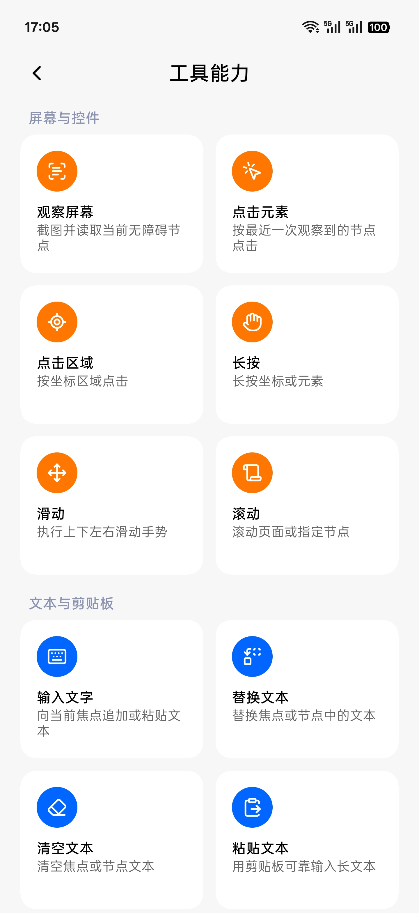

# Eta

[简体中文](README.md) | **English**

  
  
  
  
  
  
  

**A third-party, system-level AI agent for Android (BLACK-BIRTHDAY Enhanced Edition)**

With Root and LSPosed, Eta crosses the app sandbox and works at the system layer: hooking system components, taking over the power button and OEM assistant entries, and reading private data from OEM and third-party apps alike. These capabilities—close to an OEM assistant's, yet freer—are all open to the models you connect yourself (ChatGPT, Gemini 3.x, DeepSeek, Kimi, and more, with your own API keys—BYOK):

> [!TIP]
> 🌟 **Key Enhancements in this Fork**
> 1. **💎 Native Google Gemini 3.x Protocol Integration**: Full support for native `generateContent` endpoints with official branding; 1M ultra-long context window (`gemini-3.8-flash-tiered`), native adaptive thinking budget precisely aligned with Antigravity Manager / Cherry Studio variant tiers, multimodal image generation with `inlineData` Base64 stream live-rendered into Markdown images, and dual authentication (`x-goog-api-key` for official endpoints + `Bearer` token for proxy gateways).
> 2. **⚡ Zero-Copy Pipe IPC Architecture**: Completely breaks through Android's 1MB Binder transaction limit. Transcripts exceeding 32KB automatically stream over a kernel pipe (`ParcelFileDescriptor.createPipe()`), lifting context capacity up to 2,000,000 characters; atomic `user`-turn boundary truncation prevents orphaned tool-result syntax errors.
> 3. **🌊 ColorOS 16 / Android 16 Native Fluid Cloud (Live Updates)**: Full integration with Android 16 `POST_PROMOTED_NOTIFICATIONS` specifications and ColorOS 16 Pantanal LiveAlert architecture. As the agent plans, writes code, or runs terminal tests, a live breathing capsule animates beside the punch-hole camera; includes lockscreen frosted cards, AOD micro-badges, and tap-to-open ColorOS Freeform Floating Windows with 8s auto-dismiss upon completion.
> 4. **🔀 True Multi-Conversation Concurrency with Screen Mutex (Plan B)**: Replaced single-run cancellation with a concurrent session pool; pure code modification, terminal tasks, and LLM reasoning run in full parallel across conversations, while physical screen interactions are guarded by a global ScreenMutex to prevent multi-agent screen collisions.
> 5. **🛡️ Linux Container OverlayFS Golden Image & Dynamic Tmpfs**: Immutable read-only base rootfs with writable upperdir layers; instantly reset failed environments in 0.1s; 512M dynamic tmpfs RAM disk for `/tmp` accelerates compilation without persistent RAM usage; Agent detects sandbox mode and proactively asks whether to commit changes upon completion.
> 6. **💳 ColorOS Double-Click Power Button for Wallet**: Deeply hooks ColorOS system input dispatch. Double-click the power button in any state (screen off, lock screen, or app in foreground) to instantly bring up Google Wallet or OnePlus Wallet.

---

- **Direct system APIs** — alarms, media, volume, Wi-Fi, and more, callable directly by the model
- **Personal context** — photos, calendar, SMS, notifications, recordings, health summaries, ColorOS system memory, and recent QQ / WeChat chat images, read on demand
- **Native ColorOS 16 Fluid Cloud** — real-time capsule animations for thinking, code modification, and terminal execution, seamlessly rendered across status bar, lockscreen, and AOD
- **Native Google Gemini support** — native Google Gemini 3.x / GenAI protocol support (generateContent) with 1M context windows, adaptive thinking budget, and native multimodal image generation with Markdown streaming render
- **Zero-Copy Pipe IPC** — Linux kernel pipe streaming bypasses Android's 1MB Binder transaction limit, easily powering 2,000,000-character context with atomic round-level truncation
- **Built-in browser** — loads pages in the background, extracts content, and interacts with page elements; the user can take over when needed
- **A redesigned terminal** — a terminal experience rethought for mobile: a persistent manual terminal with multiple sessions, an interactive PTY console, durable daemon tasks, shared folders, and Linux file browsing; choose either Alpine or Debian userland
- **Built-in Kimi Code** — Kimi Code comes preinstalled in the Linux environment, and the mobile-friendly Kimi Web UI launches from the home screen in one tap—smooth Vibe Coding right on your phone
- **GUI agent** — third-party apps exposing APIs or CLIs would be the ideal path, but the closed mobile ecosystem leaves most apps without any machine interface; and interfaces are designed for people, inherently unfriendly to models. The long tail without an interface is handled by watching the screen and acting on controls
- **System shortcut enhancements** — double-click power button on ColorOS to directly launch Google Wallet or OnePlus Wallet

Other third-party phone agents serve mainstream users, and mainstream users don't have Root—so their capabilities stay inside the app sandbox, while system entry points and data belong to the vendor. Desktop coding agents (Codex, Claude Code) or OpenClaw, when ported directly onto a phone, remain a lobster trapped in the sandbox: no complete system environment, no way to operate the real Android device. And OEM assistants, constrained by their own ecosystems, don't touch third-party app data.

Eta can already watch the screen and order you a milk tea, but tapping screens should not be the destination. When the system can be reached directly, there is no need to simulate taps—the phone in the model's hands is a computer it can actually use.

Your phone holds most of your data. With your permission, photos, notifications, calendars, notes, recordings, location, and health summaries join long-term memory as context, and Eta goes beyond carrying out commands: it gradually learns what matters to you and understands the story behind a request. No friend knows you better than your phone, and Eta can be that friend. Closeness does not mean giving up boundaries: every capability has its own switch, and you choose the model, what it may see and do, and when it must stop.

> [!NOTE]
> Full capability requires **Root** and **LSPosed** with libxposed API 102. The app itself is not limited to OPPO or Xiaomi hardware; ColorOS (Breeno) and HyperOS (XiaoAI) describe only the current system-assistant entry-point integrations.

## See it in action

|                         GUI agent                          |                   Breeno BYOK from the power button                    |
| :--------------------------------------------------------: | :--------------------------------------------------------------------: |
|  |  |

|                  Chat workspace                   |                         Shell from Breeno                          |                    Native device tools                     |
| :-----------------------------------------------: | :----------------------------------------------------------------: | :--------------------------------------------------------: |
|  |  |  |

|                    Settings                     |                    Tool controls                    |                Skills                 |
| :---------------------------------------------: | :-------------------------------------------------: | :-----------------------------------: |
|  |  |  |

## What it does

Eta is not a one-shot chat wrapper: the model issues instructions, Eta executes them, results return to the conversation, and the model decides what to do next—until the task is done. Four execution paths combine within a single task:

| Path | What it covers |
| ---- | -------------- |
| **Native device tools** | Alarms, timers, media control, volume, Wi-Fi / Bluetooth, device and storage state, plus on-device search across photos, calendar, contacts, SMS, notifications, health summaries, and ColorOS notes and system memory—all structured tools with explicit schemas |
| **Embedded browser** | Loads JavaScript-heavy pages offscreen, extracts structured content, and operates page elements; when human intervention helps (e.g. a CAPTCHA), the same WebView attaches to the app UI for direct takeover |
| **Terminal and files** | Authorized `user` / `root` shell commands, file access, and scripts; the user-facing terminal offers multiple sessions, an interactive PTY console, daemon tasks, shared folders, and file browsing; choose either lightweight Alpine (musl) or broader Debian glibc, install the base environment first, then add tools as needed; China-network installs prefer one measured domestic mirror with an official fallback |
| **GUI / computer use** | Screenshots, accessibility nodes, tapping, scrolling, and text input, with an overlay and gesture feedback during foreground work that you can interrupt or take over. Covers the long tail of apps with no machine interface |

On top of that:

- **Zero-Copy Pipe IPC:** eliminates Android's 1MB Binder transaction limit by automatically streaming conversation history over a `ParcelFileDescriptor.createPipe()` when payload exceeds 32KB; lifts context limit to 2,000,000 characters with atomic `user`-turn boundary truncation to prevent orphan tool-result syntax errors
- **Long-term memory:** cross-conversation memory lives in one on-device `MEMORY.md`, injected on demand per task; Settings exposes usage, full editing, clearing, and an off switch
- **Skills:** browse and install Skills from public GitHub repositories or import a local ZIP; the model reads them on demand, and installation never executes packaged scripts
- **MCP tools:** connect remote Streamable HTTP servers and add individually enabled third-party tools to the Agent Loop; supports HTTP / HTTPS and an optional bearer token
- **Sessions and results:** runs started from external entry points are archived into Eta conversations and recovered after process death; long-press a message to copy, edit, or delete from that turn, and regenerate any final response

## Deep-Dive Architecture & Exclusive Tech

### 1. Zero-Copy Pipe IPC Architecture (Overcoming 1MB Binder Limit)

In Android's IPC design, cross-process communication relies on the Binder driver. However, Binder has an inherent architectural bottleneck: **all active transactions for an entire process share a single ~1MB memory buffer**.

When an agent runs complex multi-step tasks with dozens of conversation rounds, or receives large terminal logs and memory payloads, traditional Binder bundle serialization triggers the dreaded `TransactionTooLargeException`, crashing the service or dropping connections.

**The Solution: Dual-Track Kernel Streaming**
- **Adaptive Dual-Track Routing**: Payloads $\le 32\text{KB}$ continue through fast in-memory Bundles. Payloads $> 32\text{KB}$ automatically switch to a Linux kernel pipe via `ParcelFileDescriptor.createPipe()`.
- **Zero-Copy Asynchronous Streaming**: The client writes UTF-8 JSON bytes in a background daemon thread, while passing the read file descriptor across Binder. The service streams directly from `ParcelFileDescriptor.AutoCloseInputStream`.
- **2,000,000-Character Capacity**: Transcript capacity is expanded from 96,000 chars to **2,000,000 characters**, unleashing modern long-context LLMs.
- **Atomic User-Turn Truncation**: Simple message-count truncation risks cutting conversations off at an isolated `tool` or `model` message, causing a 400 Bad Request error from LLM APIs. This branch guarantees truncation always occurs strictly at a **`user` turn boundary**, preserving valid conversation structure.

---

### 2. Native Google Gemini 3.x Protocol Guide

This fork integrates Google Gemini alongside OpenAI and Anthropic as a first-class citizen:

- **Native Protocol & Brand Identity**:
  - Positioned 2nd in global provider order, calling `v1beta/models/{model}:streamGenerateContent` directly.
  - **Dual Smart Authentication**: Calls to official Google endpoints (`generativelanguage.googleapis.com`) use `x-goog-api-key` (preventing `ACCESS_TOKEN_TYPE_UNSUPPORTED` errors); calls to third-party gateways (e.g., One API, New API, custom reverse proxies) automatically inject `Authorization: Bearer`.
- **Curated Models & Forward Compatibility**:
  - `gemini-3.8-flash-tiered`: Flagship conversation and coding model with a massive **1,048,576 (1M)** context window, multimodal input, and native thinking.
  - `gemini-3.1-flash-image` / `gemini-3-pro-image`: Native image generation models, automatically whitelisted from chat-capability filters.
  - **Regex Forward Matching**: Matches `^gemini-(?:[3-9]|\d{2,})\..*`, granting future Gemini 4.x / 5.x releases instant 1M context privileges without app updates.
- **Native Thinking Budget Control**:
  - `Adaptive (Default)`: Passes `-1` to let Gemini dynamically assess reasoning depth.
  - `Off`: Passes `0` for instantaneous responses without deliberation.
  - `Low`: `4096` tokens
  - `Medium`: `16384` tokens
  - `High`: `32768` tokens
  - `Max`: `65535` tokens (avoiding the 65536 overflow boundary)
- **Multimodal Image Generation & Live Markdown Rendering**:
  - Parses `inlineData` Base64 streams from image models into standard Markdown images for instant, inline rendering in chat.

---

### 3. ColorOS Double-Click Power Button for Wallet

Designed for quick mobile transit and tap-to-pay on ColorOS (OPPO / OnePlus):
- From any state (**screen off, lock screen, home screen, or inside any app**), double-clicking the power button instantly launches **Google Wallet** or **OnePlus Wallet**.
- Tap transit gates or payment terminals without unlocking or searching for apps.

---

### 4. Native ColorOS 16 / Android 16 Fluid Cloud & Live Updates

Eliminating the need for fragile SystemUI decompilation, this fork natively harnesses Android 16's official Live Updates specifications while integrating with ColorOS 16's Pantanal Fluid Cloud engine:
- **Official Privilege Declaration**: Declares Android 16's new `android.permission.POST_PROMOTED_NOTIFICATIONS` permission, legally registering Eta in the system's "Fluid Cloud Live Activities" roster.
- **Google Maps-Grade Parameters**: Injects `setRequestPromotedOngoing(true)`, `FLAG_PROMOTED_ONGOING` (`0x40000`), and `ProgressStyle` templates under `CATEGORY_NAVIGATION` during foreground operations to trigger top-tier live capsule transitions.
- **Compact Precision Typography & 500ms Damping**:
  - Automatically formats the collapsed capsule state with concise verbs and file targets (`[🧠 Planning]`, `[📝 Writing: AuthService.kt (2/5)]`, `[🔨 Running: gradlew]`).
  - Employs 500ms damping to ensure instant transitions on major milestones while preventing status-bar frame drops during heavy output.
- **Lockscreen Cards, Freeform Windows & Elegant Dismissal**: Renders frosted translucent progress cards on the lockscreen; tapping the capsule instantly invokes Eta as a **ColorOS Freeform Floating Window** for seamless multitasking; gracefully auto-dismisses 8 seconds after completion.

---

## A terminal redesigned for mobile

Eta packs a complete computing environment into the phone: beyond the Android `user` / `root` shell, you can install an Alpine or Debian userland—all inside one terminal experience rethought for touch.

- **Persistent manual terminal:** parallel sessions you can switch between at any time, living independently of agent runs
- **Interactive PTY console:** a real TUI experience with arrow keys, shortcuts, scrolling, and ANSI rendering
- **Daemon tasks:** long-running jobs keep going after you leave the page, with logs available anytime
- **Shared folders:** mount any Android directory into the Linux environment at `/workspace/mounts/`, readable and writable both ways
- **File browsing:** browse and preview files inside the Linux environment right in the app

### Built-in Kimi Code

- Kimi Code comes preinstalled in the Linux environment, ready out of the box
- One tap on the home screen launches the mobile-friendly Kimi Web UI, so a coding session is always within reach

## What you can ask Eta to do

- **Native device actions:** “Set an alarm for 7 AM,” “pause the music,” “set media volume to 30%,” using structured system interfaces first
- **Understand your recent activity:** “What have I been busy with lately?”, “Have I been sleeping too late?”, drawing only on relevant calendar, notification, app-activity, health-summary, and memory context
- **Plan the day ahead:** combine tomorrow's schedule, places, and existing alarms to suggest when to leave, then create the reminder through a system capability
- **Track what is happening now:** find order status, pickup codes, and shipments in system memory and the notification history saved after authorization
- **Recover scattered information:** search recording summaries, files, photos, and notes for a book title or place you only vaguely remember
- **Review chat images:** find recent QQ or WeChat images, then inspect representative ones with the vision tool
- **Cross-app work and comparison:** finish to-dos inside an app, or analyze a product screenshot and search for the same item in another shopping app—falling back to screen operation only when no direct capability exists
- **Web research:** read JavaScript-rendered pages in a persistent background session, handing control to you when a challenge appears
- **Terminal work:** “Inspect LSPosed logs for hook errors, check whether my Magisk module is active, and clean up background processes”
- **Coding on the phone:** use the preinstalled Kimi Code in the built-in terminal, or launch Kimi Web from the home screen—edit code, run commands, commit, and push without leaving your phone
- **Assistant-triggered workflows:** start multi-step tasks from Eta's assistant panel, Breeno, or Super XiaoAI and let the same Runtime carry them out

## System assistant and OEM entry points

### Eta as the native digital assistant

Eta registers a standard Android `VoiceInteractionService`: open **Eta system assistant** on the Settings page, then choose Eta in Android's digital-assistant picker. Invocation shows a full-screen panel with the keyboard focused, supports streamed answers, follow-up turns, cancellation, and result archiving, and can attach the screen from before invocation as image context for the next message. Speech recognition and text-to-speech playback are not currently provided.

### ColorOS power-button target

Under **System assistant takeover** in Eta's Settings, the ColorOS long-press target can be selected explicitly:

| Target | Long-press behavior | Automatic default-assistant configuration |
| ------ | ------------------- | ----------------------------------------- |
| Breeno | Preserve the original ColorOS behavior | Never changes the system default assistant |
| Gemini | Use Google's existing system-assistant path | Switch to Gemini when the option is enabled |
| Eta | Open Eta's native text-assistant panel | Switch to Eta when the option is enabled |

New installations default to Breeno; users who had enabled the former **Launch Gemini with the power button** option remain on Gemini. Automatic default-assistant configuration is a separate option and applies only to Gemini and Eta. If the selected target cannot start, that long press immediately falls back to Breeno. HyperOS power-button routing is not implemented yet.

### ColorOS double-click power button for Wallet

Hooks ColorOS system input dispatch via LSPosed / libxposed, enabling a double-click on the power button to instantly bring up Google Wallet or OnePlus Wallet from either the lock screen or unlocked state.

### Breeno and Super XiaoAI

- **Breeno (ColorOS):** takes over the conversation entry point, inherits the current conversation's text context, parses image input, and hands the request to the shared Agent Runtime. BYOK is supported, and only requests beginning with `/agent` are claimed by default
- **Super XiaoAI (HyperOS):** supports text plus one local image or screenshot, and returns to the native flow if any precondition check fails. Verified on version `7.13.32.0016` (`507013032`) on a physical device

### Gemini and Circle to Search (ColorOS)

These features do not depend on entry points ColorOS already provides—Eta creates or repairs them:

- **Gemini unlock:** Google App device-eligibility repair, systemization, default-assistant and power-button routing, plus lock-screen / screen-on voice input and screen-off hotword compensation
- **Circle to Search:** enable and repair Android's otherwise unavailable `contextual_search` service and Google App eligibility, then use navigation-handle long press and two-finger screen recognition as triggers without modifying system files

Gemini unlock and Circle to Search were Eta's original Google enablement features. They are no longer the main development focus, but they remain maintained.

## Models and BYOK

- **Protocols:** Google Gemini native GenerateContent, OpenAI-compatible Chat Completions, Responses API, and Anthropic Messages, with SSE streaming, tool calls (function calling), multimodal image input, and deep reasoning; Gemini supports native adaptive thinking budget and multimodal image generation with streaming Markdown rendering; Responses can show reasoning summaries and enable server-side web search per provider
- **Built-in providers:** OpenAI, Anthropic, **Google Gemini**, Alibaba Cloud Model Studio, DeepSeek, Kimi, Xiaomi MiMo, MiniMax, StepFun, SiliconFlow, and OpenRouter
- **Custom providers:** HTTP/HTTPS base URL, API key, headers, and body JSON; plain HTTP transmits the API key, prompts, and model content without transport encryption
- **Model management:** bundled official catalogs, remote list sync, custom models, and fuzzy search; context-length and reasoning-effort overrides always win over later remote syncs, and each provider remembers its last selected model
- **Data backup:** Settings can export or import conversations, model provider configuration, and `MEMORY.md` for package-name changes or device migration; backup files contain provider API keys and should be stored securely

BYOK—Bring Your Own Key—means the agent follows the capabilities of the model and provider you choose instead of being locked to one bundled service.

## Installation

<b>Show installation steps</b>

1. Install the APK, open Eta, and configure a model provider, API key, and active model.
2. Grant overlay, accessibility, installed-app visibility, location, notification-access, usage-access, and background-execution permissions as needed; location tasks launched from assistant entry points such as Breeno require “allow all the time”.
3. Enable native device tools, sensitive reads, sensitive device actions, and terminal/file tools as needed; remote MCP servers can be added under **Context & extensions**, where each tool is enabled individually; choose the terminal identity explicitly as `user` or `root`, and install the optional Linux environment for tools such as Git, with the Python toolchain installable on demand inside it.
4. Enable Eta's accessibility service in Android Settings.
5. Optional system entry points:
   - Eta as the native digital assistant: open **Eta system assistant** in Settings and select Eta in the Android system picker.
   - ColorOS power-button routing, OEM assistant takeover, ColorOS system memory, Gemini, and Circle to Search: enable the module in an LSPosed environment with libxposed API 102, check scopes for `system`, SystemUI, Google App, Breeno screen recognition, Breeno, Breeno Memory, and Super XiaoAI as needed, then restart the phone.

## Permissions and security

- Native device tools, sensitive reads, sensitive device actions, terminal and file access, browser control, and memory are individual options enabled by default; the Runtime rereads them before each run, and you can disable any of them at any time.
- Tool calls validate arguments against the same JSON Schema the model sees; beyond that, Eta adds no permission prompts, dangerous-command blocklists, protected-package blocklists, or file-root boundaries.
- SMS verification codes, Wi-Fi passwords, notification text, logs, and personal-data search results stay inside the current turn and are not saved to the conversation transcript; notification history is kept locally for 7 days up to 1,000 entries only after notification access is granted.
- MCP tools default to off, and whole servers can be disabled; HTTP and HTTPS endpoints are both supported, bearer tokens are stored encrypted in the Android Keystore, and arguments or results are not written to long-term conversation history.
- Memory reads and writes likewise serve only the current turn, while long-term transcripts store only sanitized summaries; files referenced in chat enter context using root-verified paths without copying or uploading the file itself.
- Foreground GUI runs display an overlay and gesture indicator, allowing you to stop the agent or take over anytime.

## Boundaries and known limits

- **Third-party integration limits:** Eta cannot obtain the private permissions granted to built-in system components; UI polish, transition animations, and system-wide cohesion will not match an OEM assistant.
- **Version compatibility:** system entry points hook ROM, system component, and target-app implementations, which may require updates after major OS or app upgrades.
